# Project 12 — S3 Data Pipeline with Lambda and SNS

## Overview
Built a fully automated serverless data pipeline triggered by S3 file uploads. When any file is uploaded to the pipeline S3 bucket an event notification automatically triggers a Python Lambda function which extracts the file metadata and publishes a formatted notification to an SNS topic — delivering an email to subscribers within seconds. Zero servers, zero manual steps, zero cost at portfolio scale.

## AWS Services Used
- **Amazon S3** — data source bucket with event notification configured to trigger Lambda on all object create events
- **AWS Lambda** — Python 3.12 serverless function that processes S3 events and publishes SNS notifications
- **Amazon SNS** — notification topic with email subscription delivering pipeline alerts to inbox
- **AWS IAM** — least-privilege Lambda execution role with S3 read and SNS publish permissions
- **Amazon CloudWatch** — automatic Lambda execution logging for monitoring and debugging

## Architecture

```
File uploaded to S3 — data-pipeline-dcprice79-2026
        ↓ S3 Event Notification (ObjectCreated)
Lambda — s3-pipeline-processor (Python 3.12)
        ↓ Extracts: bucket, file name, size, timestamp
        ↓ boto3 sns_client.publish()
SNS Topic — data-pipeline-notifications
        ↓ Fan-out to all subscribers
Email delivered to inbox within seconds
```

## What I Built

### S3 Bucket Configuration
- Private bucket with all public access blocked
- S3 Event Notification configured on All object create events
- Event notification target: Lambda function s3-pipeline-processor
- SSE-S3 server-side encryption enabled by default

### Lambda Function (Python 3.12)
- Parses S3 event record to extract bucket name, object key, file size, and timestamp
- Formats file size dynamically (bytes, KB, or MB)
- URL-decodes object key to handle filenames with special characters
- Publishes formatted notification message to SNS topic with descriptive subject line
- Logs execution details to CloudWatch automatically
- Handles exceptions with informative error logging

### SNS Topic and Subscription
- Standard SNS topic with email protocol subscription
- Email subscription confirmed before testing
- Subject line includes filename and size for quick inbox scanning
- Message body includes all file metadata and pipeline attribution

### IAM Security
- Dedicated Lambda execution role: lambda-s3-pipeline-role
- Permissions: AWSLambdaBasicExecutionRole, AmazonSNSFullAccess, AmazonS3ReadOnlyAccess
- Least-privilege design — Lambda cannot modify S3 or access other services

## Pipeline Execution Results
- Upload triggers Lambda within 1-2 seconds of completion
- Email delivered within 10-30 seconds of upload
- Pipeline handles any file type and any file size
- Tested with multiple file uploads — pipeline executes reliably on every trigger

## Key Learnings
- How S3 event notifications enable event-driven architecture without polling
- How Lambda processes structured event payloads from S3
- How SNS fan-out delivers one message to multiple subscribers simultaneously
- How CloudWatch automatically captures Lambda execution logs for monitoring
- How boto3 Python SDK enables Lambda to interact with SNS programmatically
- Why event-driven pipelines are cost-effective — zero cost when no files are uploaded

## Production Applications
This pattern is used in production for:
- Medical imaging upload processing and routing
- Insurance claim document ingestion and validation
- Financial transaction file processing and alerting
- ETL pipeline triggers for data warehouse ingestion
- Security monitoring for sensitive bucket access

## Production Improvements
- Add file type filtering using S3 event suffix filters
- Store pipeline execution metadata in DynamoDB for audit trail
- Add SQS dead-letter queue for failed Lambda executions
- Implement S3 Object Lambda for on-the-fly file transformation
- Add CloudWatch alarm for Lambda error rate monitoring

## Cost
$0.00 — S3 event notifications are free, Lambda (1M free requests/month), and SNS (1,000 email deliveries free/month) all within free tier at portfolio scale.

## Screenshots
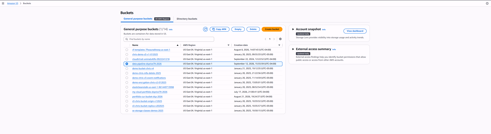
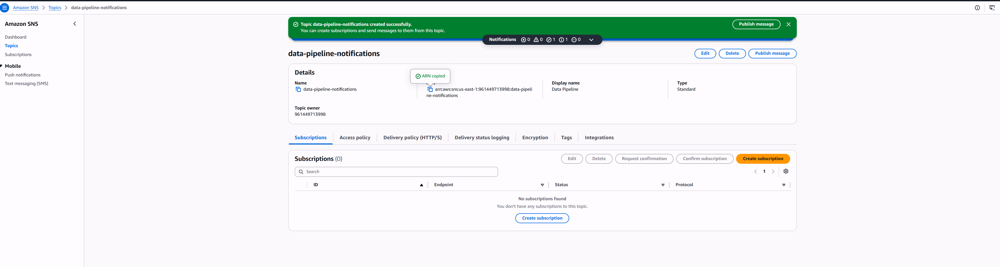

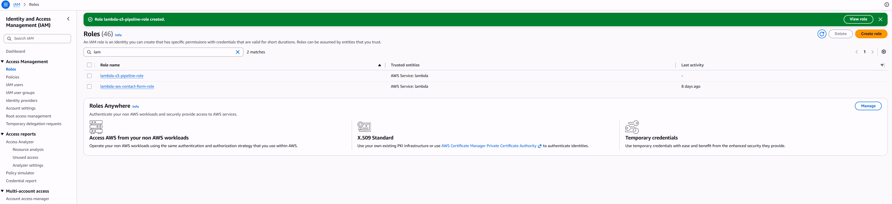
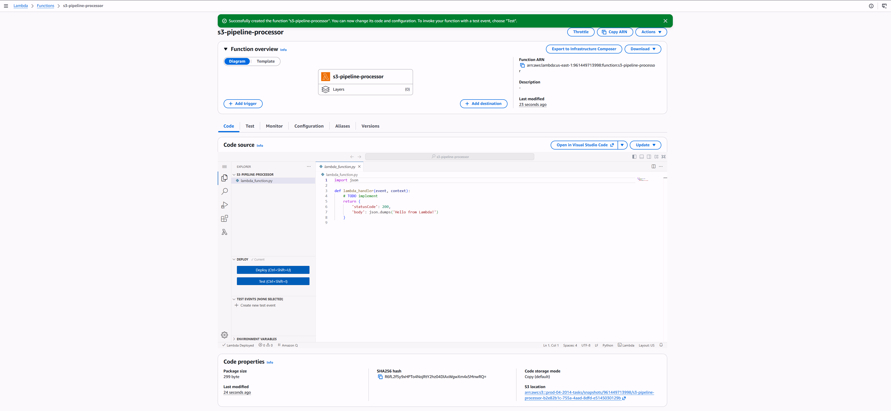
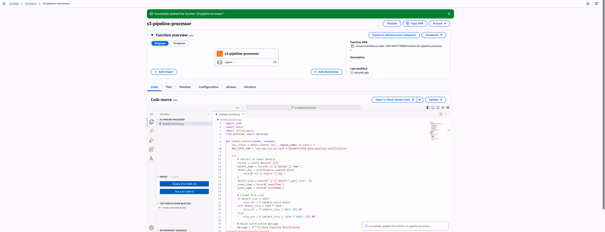
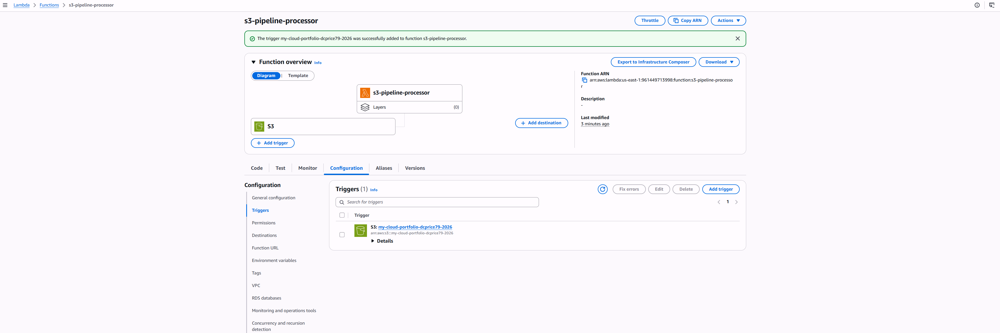
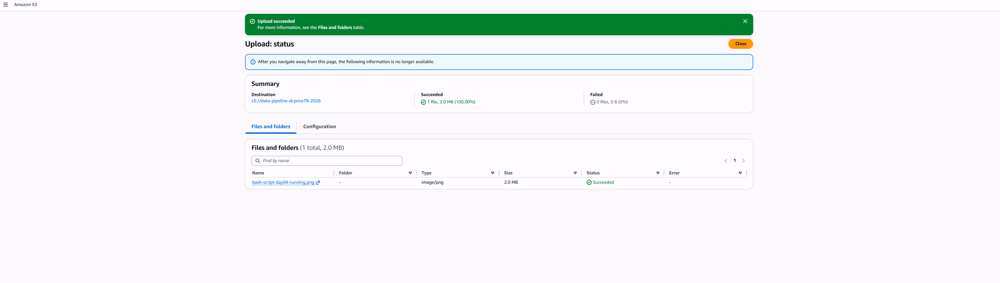
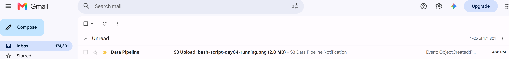
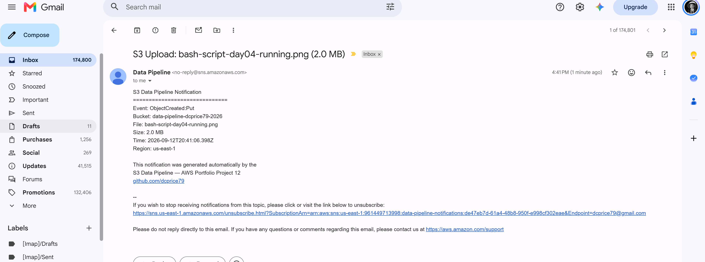
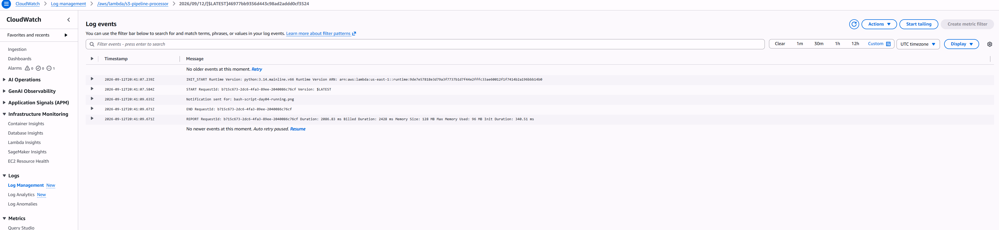

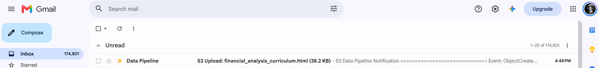
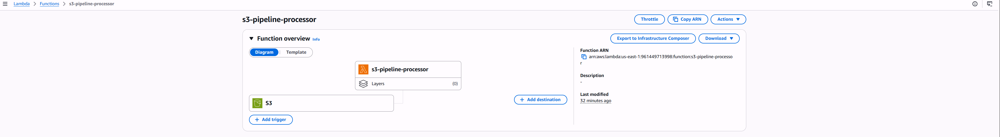
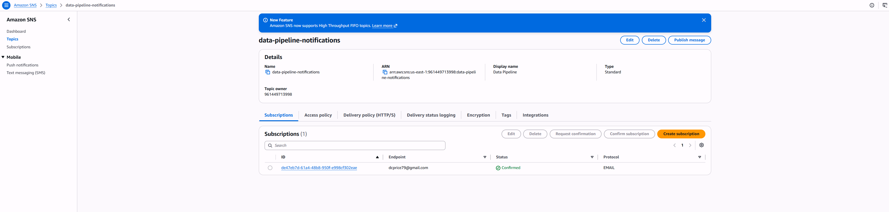
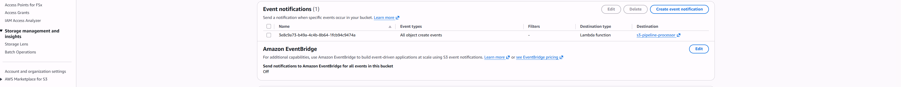

---
*Part of my AWS Cloud Engineering Portfolio | [View all projects](https://github.com/dcprice79)*
